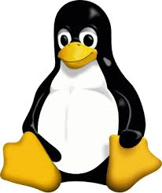
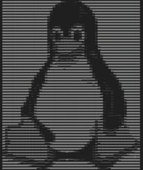

# Image to ASCII Art

| Original (`tux.jpg`) | Result (`tux.txt`) |
| :---: | :---: |
|  |  |

This project, created in Python, allows the user to convert an image into a text-based representation (ASCII art). For practicality, I used the **[Pillow library](https://github.com/python-pillow/Pillow)** to interpret and manipulate the image files.

## Features

- **Grayscale Conversion**: Automatically converts input images to grayscale for better character mapping.

- **Flexible Scaling**: Support for both percentage-based scaling and fixed-dimension resizing.

- **Custom Alphabets**: Define your own set of characters to represent different brightness levels.

- **Aspect Ratio Correction**: Automatically doubles characters horizontally to compensate for terminal line spacing.

## How to run
To run the program, you'll need to have the Pillow library installed on your system. To install it, run:

```bash
pip install Pillow
```

### Usage Syntax

The script requires an input image (placed in the /input folder) and a resizing method (either --scale or (--width and --height)).

```bash
python main.py [file_name] --scale [float] --alphabet [string]
# OR
python main.py [file_name] --width [int] --height [int] --alphabet [string]
```

### Command Line Arguments

Argument | Type | Description
file_name|Positional|The name of the image file located in the /input directory.
--scale|Float|"Multiplier for the image size (e.g., 0.5 for half size). Mutually exclusive with --width."
--width|Integer|Desired width in characters.
--height|Integer|Desired height in lines (used only if --width is specified).
--alphabet|String|"(Optional) Characters used for art, from darkest to lightest. Default is "" -""."

### Examples

```bash
# Example 1: Rescale by 50% using a custom dense alphabet
python main.py tux.jpg --scale 0.25 --alphabet " .:-=+*#%@"

# Example 2: Resize to specific dimensions
python main.py logo.png --width 100 --height 50 --alphabet " .:"
```

## How it Works

1) **Initialization**: The script opens the image and converts it to an L mode (8-bit pixels, black and white) grayscale image.

2) **Resizing**: The image is resized based on the provided scale or dimensions.

3) **Pixel Mapping**:

    - The image is parsed into a 2D matrix of pixel values (0–255).

    - Each pixel value is mapped to a character from the provided alphabet based on brightness thresholds.

4) **File Generation**: The resulting matrix is saved as a **.txt** file in the **/output** directory. Characters are doubled during writing (**char + char**) to maintain a more natural aspect ratio in text editors.